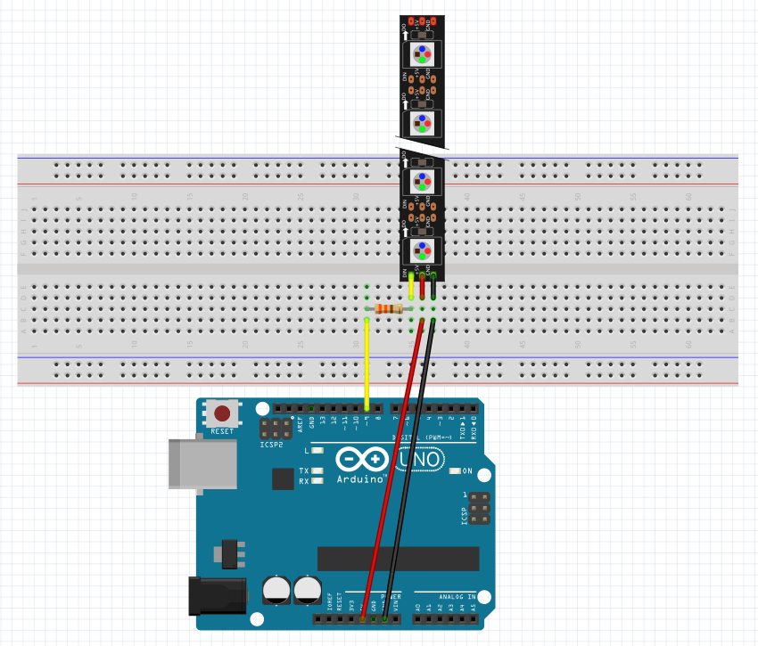
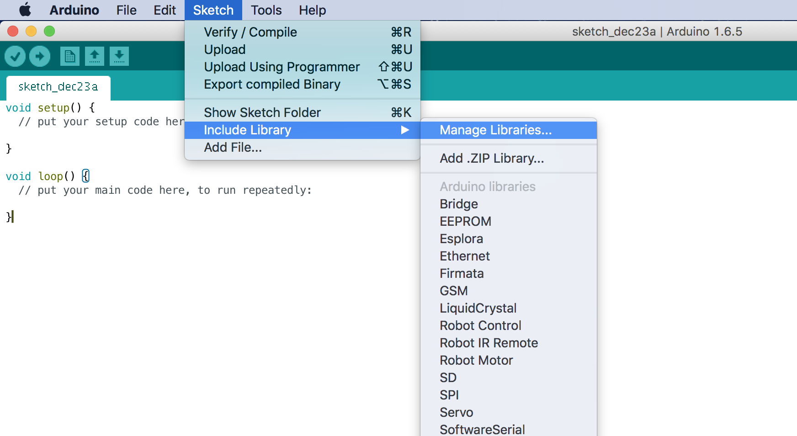
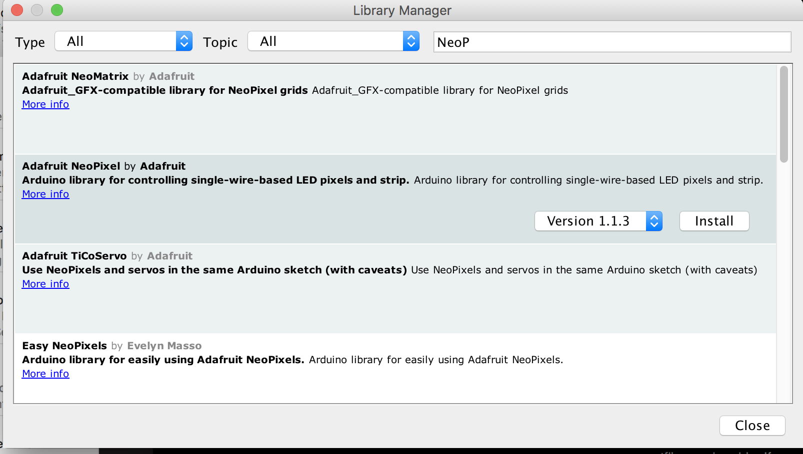
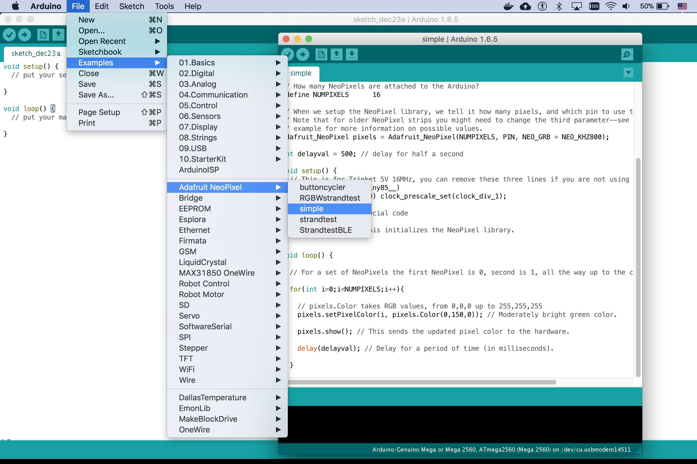
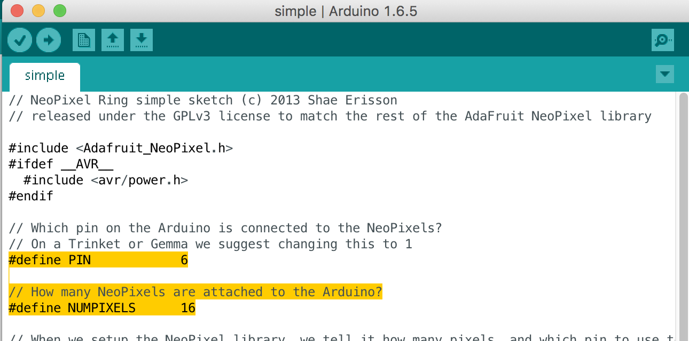
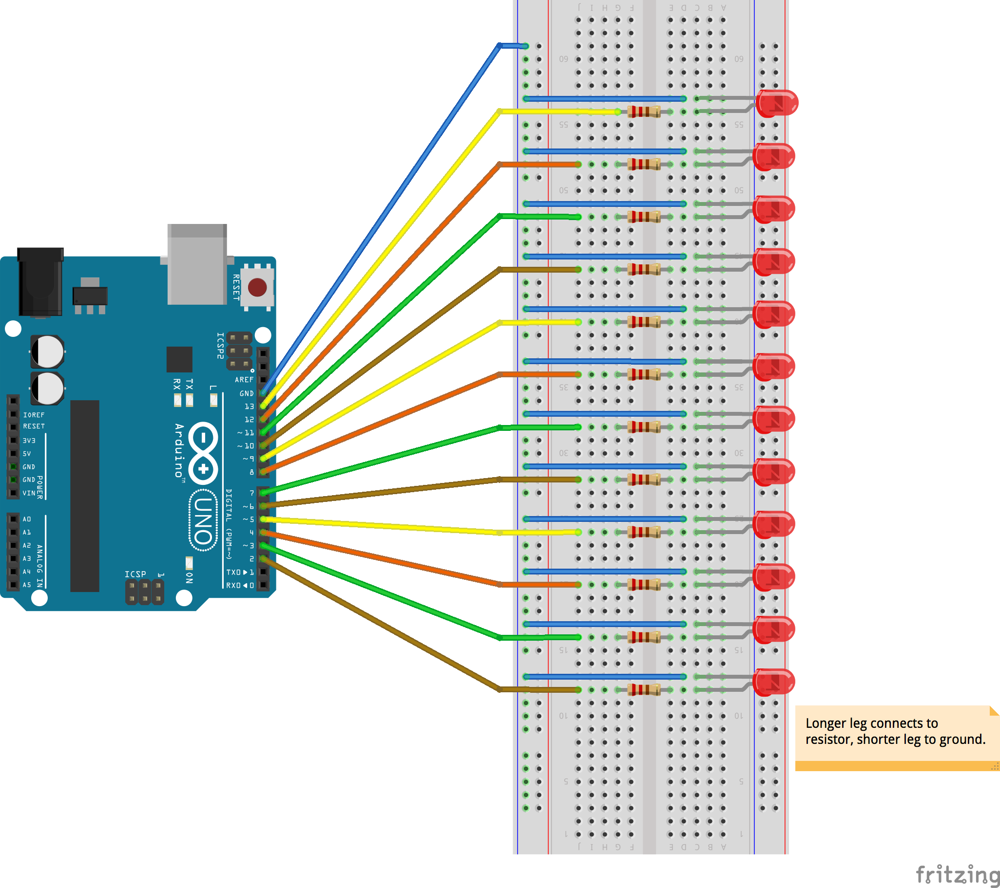
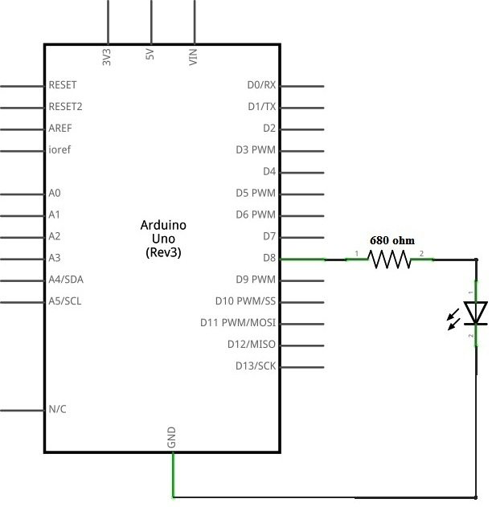
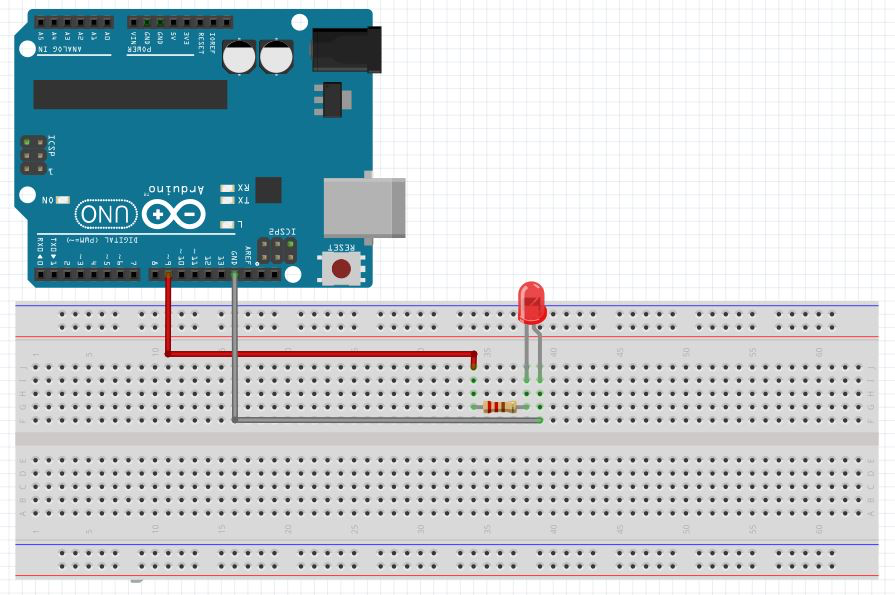
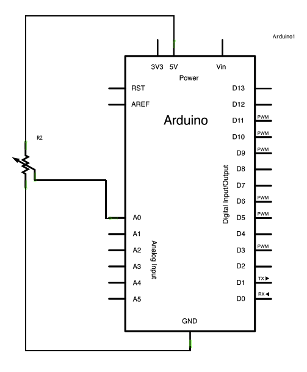
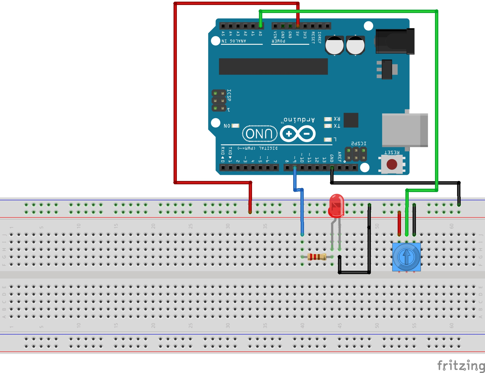

# Table of Contents

- General announcements
  - [Introduction](#introduction)
- Lab Activities
  - [Lab 1: Circuits and GPIO Control with Arduino](#lab-1-circuits-and-gpio-control-with-arduino)
  - [Lab 2: X-mas lights with Arduino](#lab-2-x-mas-lights-with-arduino)
  - [Lab 3: X-mas lights with Arduino, Part 2](#lab-2-x-mas-lights-with-arduino-part-ii)

# Lab 3: X-mas lights with Arduino, Part II

In the previous lab, we looked at using multiple LEDs and explored the concept of `while` and `for` loops to make our coding life easier. We saw that the for-loop is really just a special case of the while loop that's great when we know how many times we want to run the loop.

Today, we will continue with control loops and will also look at using the [NeoPixel](https://www.adafruit.com/category/168) RGB LED strip. RGB LEDs are special LEDs because they can light in red, green, and blue at the same time. We can either only display one color, or a combination of two or three colors. By mixing the red, green, and blue color intensities, we can in fact create any color we want. We can represent the intensity of each color using a number between 0 and 255.

To try this out, go to [http://www.color-hex.com/color/](http://www.color-hex.com/color/), and type `rgb(71, 178, 67)` into the input box. Which color will this give you? Try generating 3-5 interesting colors and write down their `rgb()` values.

## Connecting the NeoPixel

The NeoPixel has three pins: `5V`, `GND`, and `SIGNAL`. You can connect them to your Arduino as shown below using any of the 13 digital pin on the Arduino for your `SIGNAL` pin. Because of the large number of LED's, it is better to connect `5V` and `GND` from an external `5V` supply, if available. Why do you think that is?




## Coding the NeoPixel

**Adding the NeoPixel Library**<br>
Before we can get started with the actual coding, we need to install a library that makes it easier to control the NeoPixel. An Arduino library is a set of functions, tools, that make your life easier.

To install the NeoPixel library, go to `Manage Libraries` and search for `NeoPixel`. You should see the Adafruit NeoPixel library as shown in the images below.





**Running the Example Code**<br>
To get started and see how to use the `NeoPixel library`, we are going to look at the `simple` example program, as shown in the two images below. You want to make sure to change the number highlighted in yellow to match the pin that you're connected to on the Arduino, and the number of LED's on your `NeoPixel`.





**How does the Example Code Work?**<br>

Looking at the `void loop()` program, how is the NeoPixel being controlled? Ask yourself the following,
1. How is each pin being addressed?
2. How do we set the color of each pin?

Here is the reference code:
```c
void loop() {

  // For a set of NeoPixels the first NeoPixel is 0, second is 1, all the way up to the count of pixels minus one.

  for(int i=0;i<NUMPIXELS;i++){

    // pixels.Color takes RGB values, from 0,0,0 up to 255,255,255
    pixels.setPixelColor(i, pixels.Color(0,150,0)); // Moderately bright green color.

    pixels.show(); // This sends the updated pixel color to the hardware.

    delay(delayval); // Delay for a period of time (in milliseconds).

  }
}
```

Ok, so the first thing to notice here is the for loop. Using the for loop and naming our counter variable `i`, we can easily address each LED `i` when running the loop. <br>
Next, we see that we can set the color of each pixel using the `pixels.setPixelColor()` command. This one takes two arguments: the led number `i` and the RGB color `pixels.Color(0,150,0)`. You can change the the three numbers to change the color. <br>
In order to update the LED, we say `pixels.show()`. What does the delay do here? Experiment with it by changing it and observing the behavior.

**Your Turn: Create your Own Christmas Lights**

Now that you know how to connect the NeoPixel, and how to set the color of each LED using for loops, what patterns can you come up with?

Here are some inspirations for you:

- [Exmaples](https://www.youtube.com/watch?v=POV-qvEx1ws)
- [Outdoor lights](https://www.youtube.com/watch?annotation_id=annotation_581560751&feature=iv&src_vid=IXbUM5VZqX8&v=YKY-t6-V_8E)
- [Ping Pong Balls](https://www.youtube.com/watch?v=XTa9Qhpohms)

# Lab 2: X-mas lights with Arduino

Today we will explore some fundamental programming concepts of loops and conditionals and apply them to LED lightings. Using the hardware setup shown below, how can you arrange and control them in your own way?



## Coding without loops

Imagine you want to control all 12 LEDs that you have wired up. Can you guess how much typing it would take to control each one using just basic coding that we used last time? Well, take a look at the code below, copy it to your Arduino IDE, and then try adding to it to make the LED's blink backwards from 12 to 1. What do you think, is there an easier way? How would you make this program better?

```c
int led_1 = 2;
int led_2 = 3;
int led_3 = 4;
int led_4 = 5;
int led_5 = 6;
int led_6 = 7;
int led_7 = 8;
int led_8 = 9;
int led_9 = 10;
int led_10 = 11;
int led_11 = 12;
int led_12 = 13;

void setup() {
  // set communication with the computer
  Serial.begin(9600);

  // set the pins as output pins
  pinMode(led_1, OUTPUT);
  pinMode(led_2, OUTPUT);
  pinMode(led_3, OUTPUT);
  pinMode(led_4, OUTPUT);

  pinMode(led_5, OUTPUT);
  pinMode(led_6, OUTPUT);
  pinMode(led_7, OUTPUT);
  pinMode(led_8, OUTPUT);

  pinMode(led_9, OUTPUT);
  pinMode(led_10, OUTPUT);
  pinMode(led_11, OUTPUT);
  pinMode(led_12, OUTPUT);

}

void loop() {
  // blink all twelve at the same time
  digitalWrite(led_1, HIGH);
  digitalWrite(led_2, HIGH);
  digitalWrite(led_3, HIGH);
  digitalWrite(led_4, HIGH);
  digitalWrite(led_5, HIGH);
  digitalWrite(led_6, HIGH);
  digitalWrite(led_7, HIGH);
  digitalWrite(led_8, HIGH);
  digitalWrite(led_9, HIGH);
  digitalWrite(led_10, HIGH);
  digitalWrite(led_11, HIGH);
  digitalWrite(led_12, HIGH);

  delay(100);

  digitalWrite(led_1, LOW);
  digitalWrite(led_2, LOW);
  digitalWrite(led_3, LOW);
  digitalWrite(led_4, LOW);
  digitalWrite(led_5, LOW);
  digitalWrite(led_6, LOW);
  digitalWrite(led_7, LOW);
  digitalWrite(led_8, LOW);
  digitalWrite(led_9, LOW);
  digitalWrite(led_10, LOW);
  digitalWrite(led_11, LOW);
  digitalWrite(led_12, LOW);

  delay(100);

  digitalWrite(led_1, HIGH);
  digitalWrite(led_2, HIGH);
  digitalWrite(led_3, HIGH);
  digitalWrite(led_4, HIGH);
  digitalWrite(led_5, HIGH);
  digitalWrite(led_6, HIGH);
  digitalWrite(led_7, HIGH);
  digitalWrite(led_8, HIGH);
  digitalWrite(led_9, HIGH);
  digitalWrite(led_10, HIGH);
  digitalWrite(led_11, HIGH);
  digitalWrite(led_12, HIGH);

  delay(100);

  digitalWrite(led_1, LOW);
  digitalWrite(led_2, LOW);
  digitalWrite(led_3, LOW);
  digitalWrite(led_4, LOW);
  digitalWrite(led_5, LOW);
  digitalWrite(led_6, LOW);
  digitalWrite(led_7, LOW);
  digitalWrite(led_8, LOW);
  digitalWrite(led_9, LOW);
  digitalWrite(led_10, LOW);
  digitalWrite(led_11, LOW);
  digitalWrite(led_12, LOW);


  // turn led's on/off in a row with 100 millisecond interval

  digitalWrite(led_1, HIGH);
  delay(100);
  digitalWrite(led_1, LOW);
  digitalWrite(led_2, HIGH);
  delay(100);
  digitalWrite(led_2, LOW);
  digitalWrite(led_3, HIGH);
  delay(100);
  digitalWrite(led_3, LOW);
  digitalWrite(led_4, HIGH);
  delay(100);
  digitalWrite(led_4, LOW);

  digitalWrite(led_5, HIGH);
  delay(100);
  digitalWrite(led_5, LOW);
  digitalWrite(led_6, HIGH);
  delay(100);
  digitalWrite(led_6, LOW);
  digitalWrite(led_7, HIGH);
  delay(100);
  digitalWrite(led_7, LOW);
  digitalWrite(led_8, HIGH);
  delay(100);
  digitalWrite(led_8, LOW);

  digitalWrite(led_9, HIGH);
  delay(100);
  digitalWrite(led_9, LOW);
  digitalWrite(led_10, HIGH);
  delay(100);
  digitalWrite(led_10, LOW);
  digitalWrite(led_11, HIGH);
  delay(100);
  digitalWrite(led_11, LOW);
  digitalWrite(led_12, HIGH);
  delay(100);
  digitalWrite(led_12, LOW);

  // wow  ... so much typing
  // can you make it go backwards from 12 to 1?


}
```

## Coding with loops

What do you think we mean by coding with loops? What kind of programming loops have you heard of so far?

### While Loop
The first loop that we will look at is the while lop. A while loop allows you to run a set of instructions while some condition is met. You can apply this type of logic to many situations in your personal life too. For example, `while you're learning programming, you have to be very patient and pay attention to every little comma, semicolon, and parentheses`, or as you know, `while driving, you are not allowed to text on a phone`.

In programming, we can apply the same idea. For example, while some pin variable is less than 14 (`while (pin < 14)`), turn pin on (`digitalWrite(pin, HIGH)`). Then we just need make sure to update our pin variable in the loop by 1 (`pin = pin + 1` or `pin += 1`). In the code below, you can see how the `void setup()` loop and the `void loop()` loop become so much easier to type.

**Make sure to change the code to also do the following:**
- Turn one led on and off at a time starting at pin 2 and going up to pin 14
- Turn one led on and off at a time starting with pin 13 and going down to 2
- Try and come up with some other examples on your own.

```c
int pin;

void setup() {
  // set communication with the computer
  Serial.begin(9600);

  // set the pins as output pins
  pin = 2;
  while (pin < 14) {
    pinMode(pin, OUTPUT);
    pin = pin + 1;

  }
}

void loop() {
  // blink all twelve at the same time

  // blink on
  pin = 2;
  while (pin < 14) {
    digitalWrite(pin, HIGH);
    pin = pin + 1;
  }

  // wait
  delay(100);

  // blink off
  pin = 2;
  while (pin < 14) {
    digitalWrite(pin, LOW);
    pin = pin + 1;
  }


  // turn led's on/off in a row with 100 millisecond interval
  // How can you make one led at a time turn on and off using a while loop?

  // wow  ... so much less typing

  // can you make it go backwards from 12 to 1?

  // what else can you come up with?
}
```

### For Loop

Awesome, now we know how to save time on typing so many lines of code and get things done faster. The next type of loop that we're going to look at is a for loop, which is really just a special case of the whle loop. Remember that in the while loop, we alway had to update our pin variable in each loop. With the for loop we don't need to do that because we can tell the computer in advance how many time you want to execute something.

In some cultures like spain, you eat 12 grapes in the last twelve seconds of the year. So you could say `For the next 12 seconds, starting with 1 and ending with 12, you need to eat one grape per second.`

A for loop looks basically like shown below, the block in the curly braces `{}` get's repeated and the content in the parentheses `()` after the word `for` defines how often to loop and what the counter variable should be called. The first part `pin=2` means that we start with pin being equal to 2. Then we define that our `pin` counter should be less than `14` by saying (`pin < 14`), and we say that the `pin` counter should increase by `1` for every iteration. If you wanted it to increase by two, you could say `pin+=2`.


```c
for (pin=2; pin < 14; pin++) {
  digitalWrite(pin, HIGH);
  delay(100);
  digtalWrite(pin, OFF);
}
```

Let's see how this helps with the code above.

```c
int pin;

void setup() {
  // set communication with the computer
  Serial.begin(9600);

  // set the pins as output pins
  for (pin=2; pin < 14; pin++) {
    pinMode(pin, OUTPUT);
  }
}

void loop() {
  // blink all twelve at the same time

  // blink on
  for (pin=2; pin < 14; pin++) {
    digitalWrite(pin, HIGH);
  }

  // wait
  delay(100);

  // blink off
  for (pin=2; pin < 14; pin++) {
    digitalWrite(pin, LOW);
  }


  // turn led's on/off in a row with 100 millisecond interval
  for (pin=2; pin < 14; pin++) {
    digitalWrite(pin, HIGH);
    delay(100);
    digitalWrite(pin, LOW);
  }

  // wow  ... so much less typing
  // can you make it go backwards from 12 to 1?

  // what else can you come up with?
}

```


# Lab 1: Circuits and GPIO Control with Arduino

In this lab, we will continue on learning the fundamentals of circuits, how to use a breadboard, and how to write an Arduino Program that can control GPIO (general purpose input output) and read analogue voltages. This can also be done using a Raspberry Pi, but we will focus on the Arduino for now as it will help us later on.

Before we get started, here are a list of good videos that relate to today's class:
- [What is an LED? - Collin's Lab](https://www.youtube.com/watch?v=P3PDLsJQcGI)
- [What is a breadboard? - Collin's Lab](https://www.youtube.com/watch?v=w0c3t0fJhXU)
- [How to Solder - Collin's Lab](https://www.youtube.com/watch?v=QKbJxytERvg)
- [Soldering Arduino Nano](https://www.youtube.com/watch?v=37mW1i_oEpA)
- [Blinking an LED with Arduino](https://www.youtube.com/watch?v=dnPPoetX0uw)
- [Another Arduino blinking tutorial](https://www.youtube.com/watch?v=GaaMQjpPOFQ)
- Analog inputs on Arduino --- _coming soon_

If you want to see how to do all this on a Raspberry Pi with Python, you may check out this video: [GPIO Control Raspberry Pi](https://m.youtube.com/watch?v=41IO4Qe5Jzw).


## Part 1: LED Circuit

Our first circuit is an LED circuit. We can connect in an LED in series with a resistor to our GPIO output pin on the Arduino, as shown below.





## Part 2: Potentiometer Circuit

In the second circuit, we will connect a potentiometer to an Arduino analog input pin of the Arduino, as shown below. _Note: You can add this circuit to your existing circuit._




## Part 3: Arduino Coding

Ok, now that we have the hardware in place, we can start coding.
Before diving into the details of coding, let's remind ourselves what we're trying to do here:
1. Control and LED with an automated computer program
2. Read the voltage of a voltage dividing potentiometer
3. Use a potentiometer to turn an LED on and off

Now that we know our goals, we can split this problem into three different parts and write own program for each problem.

The programming approach for each of these is exactly the same, as every Arduino program is structured the same way. You can think of Arduino programs like simple a simple board game. When playing a board game, you typically do the following:
1. Define the game you are playing and some of the game rules
2. You setup the game by identifying players and setting up the "board" of the game.
3. Once everyone knows who is playing in the game and what the rules are, you can play the game. Typically this involves doing same procedures in every round of the game until someone wins.

An Arduino program is the same, except that there is no winner. You
1. Define global names and variables, e.g. `int green_LED = 9;`;
2. You setup your program in `void setup()`. Here you say what each pin is doing and at what speed you want to talk to the computer `Serial.begin(9600);`
3. Lastly there is the `void loop()`. Here you can define the routines that you want your program to execute, e.g. `digital.Write(green_LED, HIGH);`

### Problem 1: LED control

Let's think about what we need here:

1. Global variables:
  - You need to name your LED pin as an `int`. In the following line, we will define a green_LED as pin 9. You can change this based on the color that you are using, or give it any other name that you want. _The only important thing is that the number that you put here, `9`, is the pin that you are connecting to on your Arduino._
  ```
  int green_LED = 9;
  ```

2. Setup:
  - In the setup, we want to make sure that our LED pin is defined as an output:
  ```
  pinMode(green_LED, OUTPUT);
  ```
  - We also want to set the language that we're communiting with between the computer and the Arduino:
  ```
  Serial.begin(9600);
  ```

3. Loop:
  - In the main loop, we basically just want to make the LED blink. For this, you need one command that allows you to turn the LED on and off, and one that allows you put a pause in your program.
  - To turn a digital output pin on and off, or HIGH and LOW, we use the `digitalWrite()` command. So if we want to turn the `green_LED` (pin 9) on, we say
  ```
  digitalWrite(green_LED, HIGH);
  ```
  And if we want to turn it off, we use
  ```
  digitalWrite(green_LED, LOW);
  ```
  - Now because our computer is so fast, if we write on and off immediately one after another, we are going to have a problem seeing the on/off action. (Try it out and see what happens!). So, to make it blink at 1 second interval, we can put a time belay between the on-off and the off-on. (Why do you need two delays?). In Arduino, we can use the ```delay()``` command to do this. Within in the function parameters `()`, we specify the delay that we want in milliseconds. So a 1-second delay would mean that you write
  ```
  delay(1000);
  ```

The entire code should look something like shown below. Do not just copy it, but write your own program. Change the pin number to `8`, name your led something else, and change the interval (the delays) that you're blinking at.

```c
int green_LED = 9;

// the setup function runs once when you press reset or power the board
void setup() {
  // initialize digital pin 13 as an output.
  pinMode(green_LED, OUTPUT);
}

// the loop function runs over and over again forever
void loop() {
  digitalWrite(green_LED, HIGH);   // turn the LED on (HIGH is the voltage level)
  delay(1000);              // wait for a second
  digitalWrite(green_LED, LOW);    // turn the LED off by making the voltage LOW
  delay(1000);              // wait for a second
}
```

### Problem 2: Potentiometer Sensing

So far so good, let's see how we can learn more about potentiometers by sensing their output using and Arduino. Again, let's think about what we need to here:

0. Goal:
  - Our goal is read the output from the potentiometer and display it on the computer using the Serial Monitor.

1. Global variables:
  - You need to define two things here, the analog input pin that your Arduino is connected to, and a variable that can store your readings.
  ```
  int pot = 0;          // potentiometer connected to pin A0
  int reading;          // initialize integer variable to store sensor output
  ```

2. Setup:
  - Since we want to display our readings on the `Serial Monitor`, we want to make sure to set the language (speed) that we're communiting with between the computer and the Arduino:
  ```
  Serial.begin(9600);
  ```
  - Analog inputs (pins A0 - A5) DO NOT NEED to be defined in the setup, because unlike GPIO pins, these can only do one thing: reading voltage signals and digitizing it into a number between 0-1023 representing 0-5V.

3. Loop:
  - Now remember, the main loop is like a round in a boardgame, the same code is being executed over and over and over (never ending) at a very, very high speed. In fact, it's being executed as fast as the Arduino can unless if you tell it wait a little bit here and there using the `delay()` method that we also used with the LEDs.
  - To read the input on the `A0` pin, we use the `analogRead()` function. Inside the `()`, you are going to put the pin/port that you want to read from. In this case, you stored your pin number in the `pot` variable. So `analogRead(pot)` is going to to give us a number between `0` and `1023`, which means that we need to store this somehow. That where we use the `reading` variable that defined at the very top too.
  ```
  reading = analogRead(pot);
  ```
  - Next we want to print this number to the Serial monitor, so we use the `Serial.print()` command. Can you guess what the difference is between `Serial.print` and `Serial.println`. Why do we put `"Reading: "` into quatation marks and `pot` not? If you're not sure, try it out and see what happens.
  ```
  Serial.print("Reading: ");
  Serial.println(pot);
  ```
  - Now because our computer is so fast, if we don't tell it to wait a little bit, the numbers are gonna change so quickly that it's going to be hard for us to track it. In Arduino, we can use the ```delay()``` command to do this. Within in the function parameters `()`, we specify the delay that we want in **milliseconds**. So a 1-second delay would mean that you write
  ```
  delay(1000);
  ```

  The entire code should look something like shown below. Do not just copy it, but write your own program. **Change the pin number to `1` (what does that mean for our circuit?), name your `reading` variable something else (like `pot_reading`, `pot_recording`, etc.), and change the interval (the delay) that you're reading at.**

  ```c
  int pot = 0;
  int reading;

  void setup() {
    // put your setup code here, to run once:
    Serial.begin(9600);
  }

  void loop() {
    // put your main code here, to run repeatedly:
    reading = analogRead(pot);
    Serial.print("Reading: ");
    Serial.println(pot);

    delay(1000);
  }
  ```
### Problem 3: Can we combine Potentiomers and LEDs?

**How would you combine the LED program and the potentiometer program into a single program? What would you want it to do?**
To give you a possible example, have you every turn a knob that makes a light fade in and out? How do think that works?

**Hint:** <br>
In Arduino, instead of just turning pins on and off using `digitalWrite(pin, HIGH)` and `digitalWrite(pin, LOW)`, we can actually output anything in between the two. You can do this using the `analogWrite(pin, value)` function, where `pin` is the pin that you're using to connect to the LED, and `value` is a number between `0` and `255`. The higher the number, the closer the output will be to 5V, which is the maximum. So, if you want your LED to light at half the brightness, you could say
```c
analogWrite(led_pin, 127);
```
Now how can we use this for our project? Discuss with your partner how you want to use the LEDs and Potentiometers togeher.


# Introduction

Aloha! Here you will find some helpful links and resources for our weekly lab acitivities.
